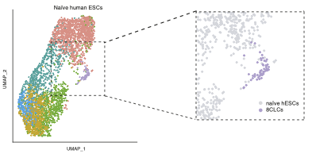

# 8C-like cells capture the human zygotic genome activation program in vitro

This repository contains the scripts to reproduce the results of the manuscript [8C-like cells capture the human zygotic genome activation program in vitro](https://www.biorxiv.org/content/10.1101/2021.10.28.466259v1.full).  

Abstract
--------
The activation of the embryonic genome marks the first major wave of transcription in the developing organism. Zygotic genome activation (ZGA) in mouse 2-cell embryos, and 8-cell embryos in humans is crucial for development. Here we report the discovery of human 8-cell like cells (8CLCs) among naïve embryonic stem cells, that transcriptionally resemble the 8-cell human embryo. They express ZGA markers including ZSCAN4 and LEUTX and transposable elements such as HERVL and MLT2A1. 8CLCs show reduced SOX2 levels, and can be identified using TPRX1 and H3.Y marker proteins in vitro. Overexpression of the transcription factor DUX4 and spliceosome inhibition increase human ZGA-like transcription. Excitingly, the 8CLC markers TPRX1 and H3.Y are also expressed in ZGA stage 8-cell human embryos and may thus be relevant in vivo. 8CLCs provide a unique opportunity to characterize human ZGA-like transcription, and might provide critical insights into early events in embryogenesis in humans.

 

Content
-------
* `/scrna/`: scRNA-seq analysis
* `/10x_multiome/`: 10x Multiome analysis

Data
-------
The raw data is accessible at GEO ([GSE121708](https://www.ncbi.nlm.nih.gov/geo/query/acc.cgi?acc=GSE121708)). 
The parsed data can be downloaded [here]()

Contact
-------
* Jasmin Taubenschmid-Stowers (Jasmin.Stowers@babraham.ac.uk)

